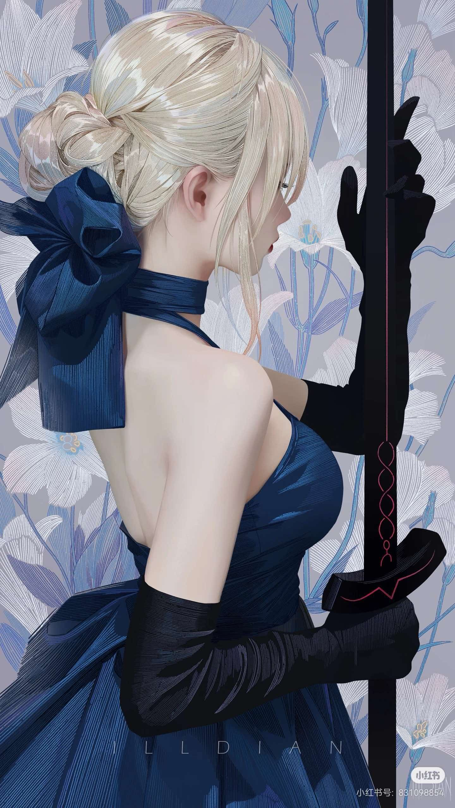
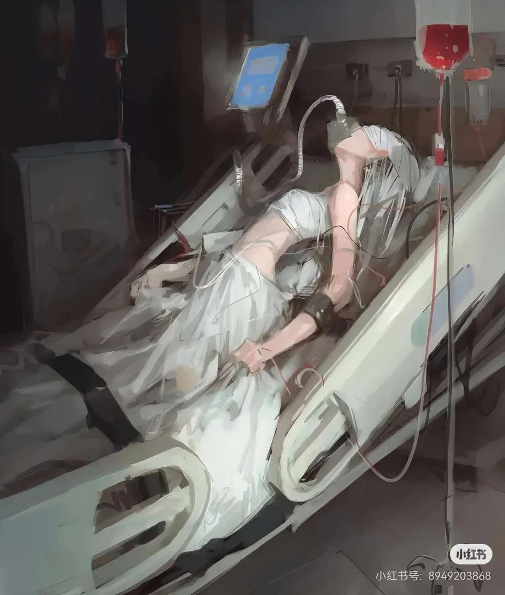
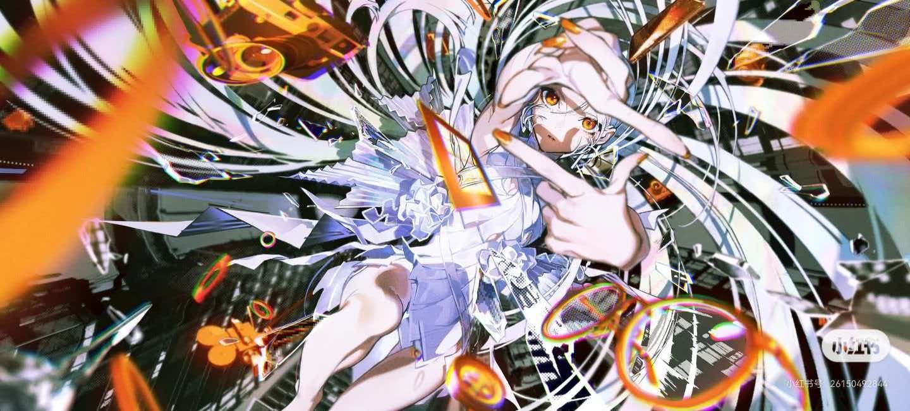

# 画师志 · 多位画师介绍网站

一个介绍三位画师（**徐尤点 / Dino / 米山舞**）的单页站点。整站是**一个 HTML 文件**：HTML、CSS、JavaScript 和图片（base64）全部内联，**零外链、零依赖、零构建**，双击即可在浏览器打开。

三位画师各有一套完全不同的视觉语言：主题色、背景作品图、视觉锤、指示点形态都不一样。

---

## 预览

| 徐尤点 | Dino | 米山舞 |
| :---: | :---: | :---: |
|  |  |  |
| 墨褐 + 朱砂 · 水墨印章 | 薄荷蓝 + 樱花粉 · 糖果圆点 | 电光紫 + 霓虹青 · 速度线像素 |

> 上面三张既是站点首屏的轮播背景，也是本仓库的预览图。

---

## 功能

**首屏轮播（90vh）**
- 三屏横滑，切换动画 `transform .6s cubic-bezier(.65,0,.35,1)`，背景交叉淡化 `.8s`
- 自动播放 5 秒；鼠标悬停、键盘聚焦、切到后台标签页时暂停，切换后重新计时
- 左右箭头、底部指示点、键盘 `←` `→` 均可切换
- 触摸滑动：距离 > 60px **且** 速度 > 0.3px/ms 才触发（避免误触）
- 指示点形态随画师变化：**方章 / 圆点 / 像素方块**
- 米山舞为深色主题，文字自动转浅色，导航栏同步反色
- 每屏内容：视觉锤 → 头像 → 姓名 / 职位 / slogan → 简介 → 标签 + 3 张代表作缩略图 + CTA → 竖排签名水印

**作品集**
- 筛选：全部 / 徐尤点 / Dino / 米山舞，选中态使用对应画师主题色
- 9 件作品，桌面 3 列 / 平板 2 列 / 手机 1 列
- Hover 上浮 + 阴影加深 + 封面缩放 1.03
- 点击卡片或缩略图打开 Lightbox（深色遮罩 + 大图 + `Esc` 关闭 + 焦点管理）

**技能 / 联系 / 其他**
- 技能：Tab 切换三位画师，4 项能力条在进入视口或切 Tab 时从 0 增长到目标值，颜色 = 画师主题色
- 联系：三组社交入口 + 留言表单（前端校验：非空 + 邮箱格式），错误项标红并给出原因，提交用自定义 Toast，不用原生 `alert`
- 全站叠加极淡纸张噪点（内联 SVG `feTurbulence`，`opacity: .03`）
- 回到顶部悬浮按钮（滚动超过一屏后出现）
- 响应式：`≥1024px` 桌面 / `768–1023px` 平板 / `<768px` 单列堆叠（slide 转上下结构、缩略图横滑、导航折叠、字号缩 15%）

---

## 快速开始

```bash
# 唯一需要做的事：双击 index.html
# 不需要 npm install，不需要 dev server，不需要联网
```

也可以直接拖进浏览器，或用任意静态服务器托管：

```bash
python -m http.server 8080    # 然后访问 http://localhost:8080
```

---

## 目录结构

```
paint/
├─ index.html               ← 站点本体：HTML + CSS + JS + 图片(base64) 全在这一个文件里
├─ img/                     ← 图片源文件（脚本从这里读取并内联）
│  ├─ bg-xuyoudian.jpg        徐尤点 轮播背景
│  ├─ bg-dino.jpg             Dino   轮播背景
│  ├─ bg-miyama.jpg           米山舞 轮播背景
│  └─ README.txt              图片命名规范（含取景 / 底板调参说明）
└─ tools/
   └─ inline-images.mjs     ← 把 img/ 里的图片转成 base64 内联进 index.html
```

---

## 换图片

图片位一共 15 个（每位画师 5 个），全部按文件名约定识别，**不需要改代码**：

| 槽位 | 文件名 | 出现在 |
| --- | --- | --- |
| 轮播背景 | `bg-<画师id>.jpg` | 首屏对应 slide 的整屏背景 |
| 作品 1–3 | `<画师id>-1.jpg` … `-3.jpg` | 首屏缩略图 + 作品集卡片 + Lightbox 大图 |
| 头像 | `avatar-<画师id>.jpg` | 首屏圆形头像 |

`<画师id>` = `xuyoudian` / `dino` / `miyama`。扩展名支持 `.jpg .jpeg .png .webp .avif .gif`，脚本自动识别。

```bash
node tools/inline-images.mjs            # 把 img/ 里的图片转 base64 写入 index.html
node tools/inline-images.mjs --check    # 只检查图片是否齐全，不改文件
node tools/inline-images.mjs --clear    # 清空内联图片，回到 SVG 占位状态
```

**缺图不会破版**：没有图片的槽位会自动回退到内联 SVG 占位插画 / 主题渐变，页面不会出现裂图。

**背景图是原图直铺**：不蒙版、不雾化、不调色。文字靠一块毛玻璃底板承托（`backdrop-filter`），所以图片本身始终是原样的。取景焦点在 `artistsData[].theme.bgPos` 里调，例如竖构图人像用 `'50% 8%'` 保住头部。

---

## 改文案与配色

所有内容都抽在两个数据结构里（`index.html` 的 `<script>` 第 1 区块），改这里就能整站生效：

```js
const artistsData = [{
  id: 'xuyoudian',
  name: '徐尤点',
  enName: 'Xu Youdian',
  title: '插画师 / 角色设计师',
  slogan: '以水墨捕捉东方幻想的旅人',
  bio: '……',
  tags: ['国风', '厚涂', '角色设计', '东方幻想'],
  avatarChar: '徐',
  theme: {
    primary: '#6b4f3a',    // 主题色（图标、指示点、Tab）
    accent:  '#a83e2f',    // 强调色（点缀、激活态）
    ink:     '#a83e2f',    // 浅底上的可读文字色（slogan / 徽标）
    fill:    'linear-gradient(135deg,#6b4f3a,#a83e2f)',          // 按钮 / 筛选选中态
    soft:    'rgba(107,79,58,.10)',                              // 徽标底色
    bg:      'linear-gradient(135deg,#fbf5e6,#f3e6cd,#e9d3ac)',   // 缺图时的兜底背景
    bgPos:   '50% 8%',     // 背景作品图取景焦点
    avatarBg:'linear-gradient(140deg,#6b4f3a,#8a6b4f,#a83e2f)',
    motif:   'seal',       // 视觉锤：seal 印章 / dot 圆点 / pixel 像素
    mode:    'light'       // light / dark（dark 会自动把文字转浅色）
  },
  works: [
    { title: '山海拾遗', year: '2024', category: '插画',
      pos: '50% 8%',       // 可选：该作品被裁切时的取景焦点
      bg: 'linear-gradient(140deg,#f7ecd6,#dcbb8c)',  // 缺图时的封面底色
      desc: '……' }         // Lightbox 里的作品描述
  ],
  socials: [{ icon: '🖌️', label: '微博 @徐尤点' }]
}];

const skillsData = { xuyoudian: [{ name: '水墨笔触', value: 92 }] };
```

> 目前作品标题、年份、简介、社交账号均为**占位数据**，请替换为真实资料后再对外发布。

---

## 设计规范

**基底令牌**（`:root`）

| 令牌 | 值 | 用途 |
| --- | --- | --- |
| `--bg` | `#faf8f5` | 页面底色 |
| `--surface` / `--surface-soft` | `#ffffff` / `#f3f0ea` | 卡片 / 次级面 |
| `--text-primary` / `--text-secondary` | `#1e1e1e` / `#5a5a5a` | 文字层级 |
| `--border` | `#e2ddd7` | 描边 |
| `--radius-card` / `--radius-el` / `--radius-pill` | `24px` / `12px` / `999px` | 圆角 |
| `--shadow-sm` / `--shadow-hover` | `0 8px 20px rgba(0,0,0,.04)…` / `0 18px 30px -8px rgba(0,0,0,.10)` | 阴影 |

**字体层级**

| 层级 | 字体 | 字号 | 字重 | 字距 |
| --- | --- | --- | --- | --- |
| 姓名 | Georgia serif | `4.5rem` | 500 | `-0.03em` |
| 章节标题 | Georgia serif | `2rem` | 500 | `-0.02em` |
| 卡片标题 | sans-serif | `1.25rem` | 600 | — |
| 正文 | sans-serif | `1rem` | 400 | 行高 `1.7` |
| 标签 | sans-serif | `0.8rem` | 600 | `0.05em` |

**无障碍**：正文与标语在三种背景下的实测对比度（取样自真实渲染结果，均达到 WCAG AA 4.5:1）

| 画师 | 正文 | 标语 |
| --- | --- | --- |
| 徐尤点 | 5.33:1 | 5.09:1 |
| Dino | 4.89:1 | 4.54:1 |
| 米山舞 | 5.51:1 | 6.28:1 |

其他：语义化标签 + `aria-label` / `aria-current` / `aria-hidden`；未激活的 slide 设 `inert` 避免误聚焦；Lightbox 打开时锁定页面滚动并在关闭后归还焦点；`prefers-reduced-motion` 下关闭动画。

---

## 技术说明

- **无构建、无依赖、无网络请求**：`grep -c "https\?://" index.html` → `0`
- 轮播用 `translate3d(-N%,0,0)` 位移整个轨道，背景是独立图层做 `opacity` 交叉淡化，因此背景与内容可以有不同的过渡时长（`.8s` / `.6s`）
- 图片位先渲染内联 SVG 占位，真实图片以 `` 覆盖在上面；加载失败时自动移除 `` 露出占位（`bg-*` 走 CSS 变量，用 `Image()` 主动探测实际扩展名）
- 技能条用 `IntersectionObserver` 触发，`rAF` 同步做数字滚动，切换 Tab 时重播
- 兼容性依赖：`backdrop-filter`（毛玻璃底板，不支持时退化为半透明纯色）、`inert`、`IntersectionObserver`、CSS 自定义属性、`aspect-ratio`。目标为现代 Chrome / Edge / Safari / Firefox

---

## 版权说明

- **代码**：可自由使用、修改、分发。
- **作品图片**：`img/` 下的三张作品图著作权归**对应画师本人**所有，此处仅作为站点演示使用；请勿商用或再分发。图片保留了原始水印。
- 站内作品标题、年份、简介为演示占位文案，不代表画师真实履历。
